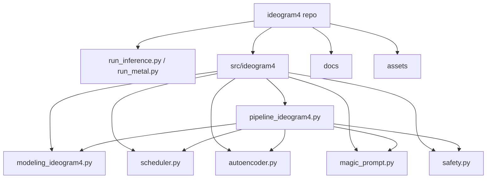
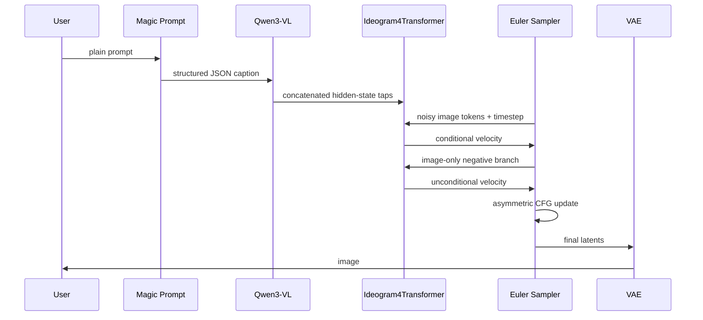
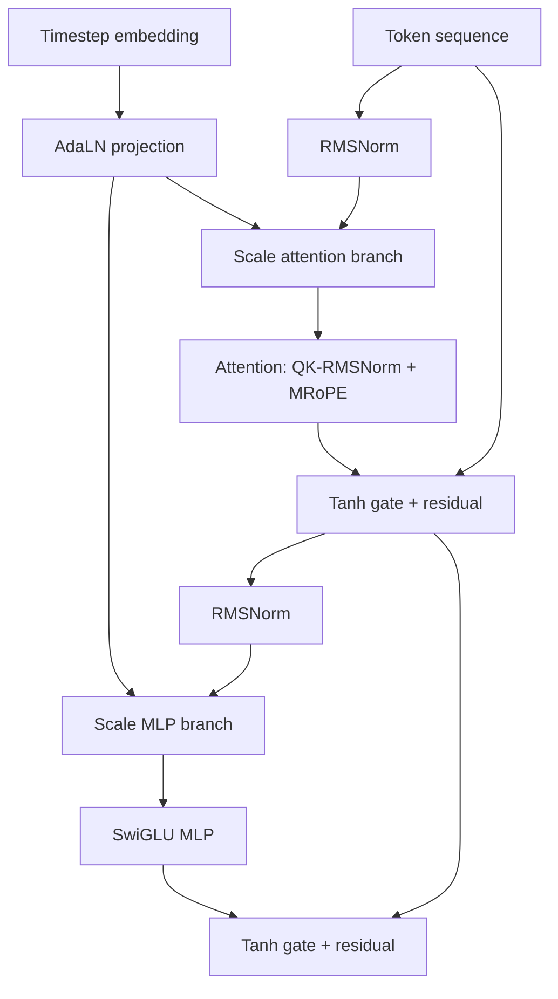
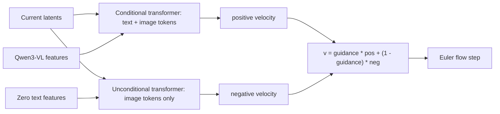
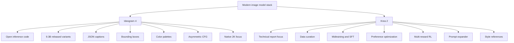
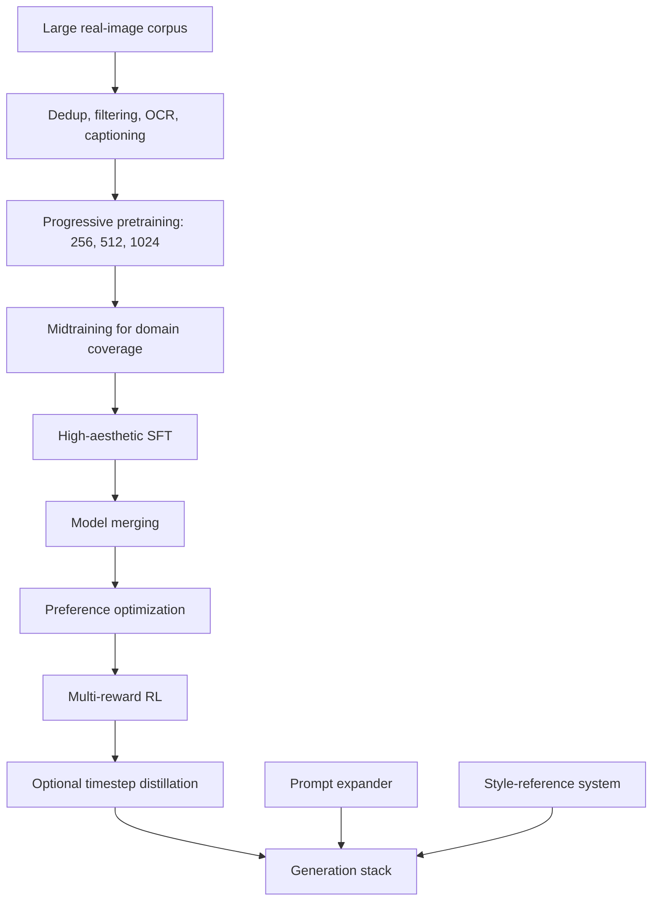

# Diagrams

This page collects the model and inference diagrams that are useful when
orienting around the Ideogram 4 codebase and comparing it with Krea 2.

## Repo Map

## Ideogram 4 Inference

## Transformer Block

## Asymmetric CFG

## Ideogram 4 vs Krea 2

## Krea 2 Training Stack

