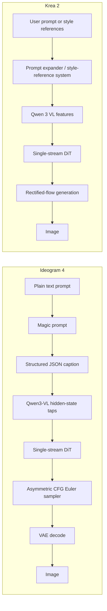
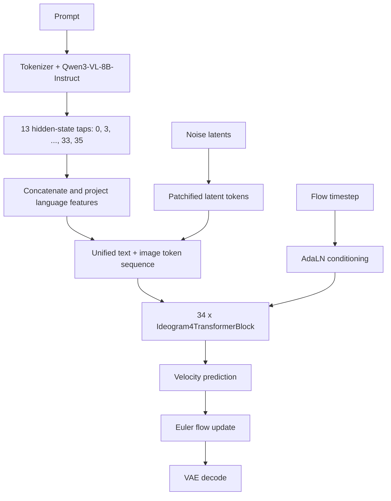
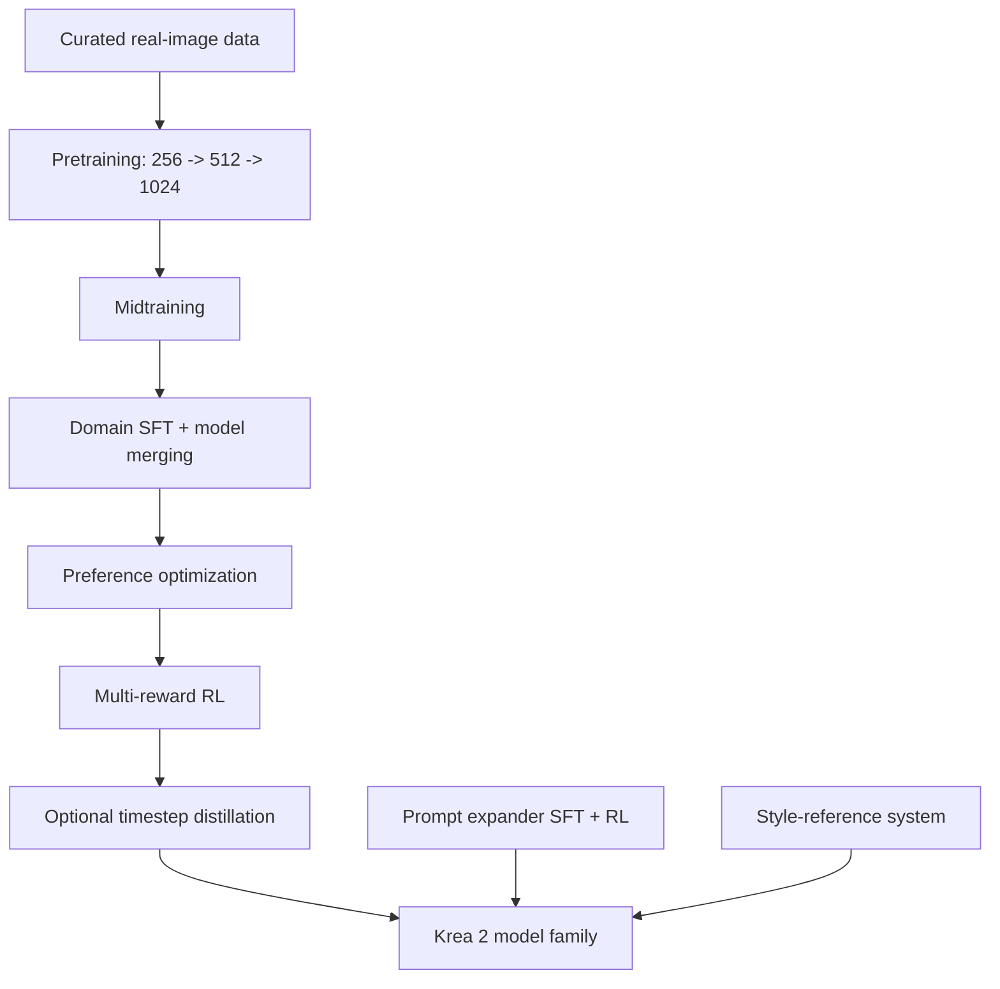
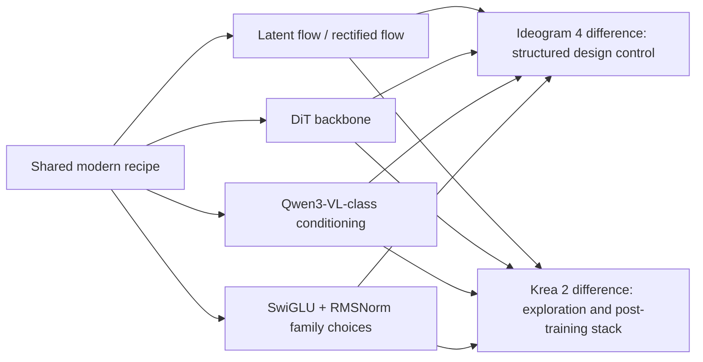

# Ideogram 4 vs Krea 2

This document compares the open Ideogram 4 implementation in this repository
with the architecture and training stack described in the public
[Krea 2 Technical Report](https://www.krea.ai/blog/krea-2-technical-report).

The short version: both models sit in the same modern family of latent
flow-matching / rectified-flow Diffusion Transformers, and both lean on
Qwen3-VL-style visual-language representations. Ideogram 4 is more explicitly
productized around structured layout control, text rendering, asymmetric CFG,
and native 2K inference in the released code. Krea 2 is presented as a broader
foundation-model series optimized for aesthetic diversity, creative exploration,
prompt expansion, style-reference control, and a heavy multi-stage post-training
stack.

## At A Glance

| Axis | Ideogram 4 in this repo | Krea 2 technical report |
| --- | --- | --- |
| Release shape | Open inference code and gated open weights | Weights and inference are described as released under a permissive license |
| Main goal | Design-first generation with strong typography, layout, palettes, and JSON control | Creative exploration across broad aesthetics with text and image-based control |
| Backbone | Fully single-stream DiT | Final architecture uses a single-stream transformer block |
| Objective / sampler | Flow-matching velocity prediction with Euler sampling and a logit-normal schedule | Standard rectified-flow loss under `v`-parameterization, shifted logit-normal schedules |
| Parameters | 9.3B for released Ideogram 4 transformer variants | Not specified in the technical report |
| Text encoder | Qwen3-VL-8B-Instruct hidden states from 13 layers are concatenated | Qwen 3 VL final encoder with feature aggregation across layers |
| Attention | Multi-head attention with QK-RMSNorm and MRoPE | GQA with gated sigmoid attention |
| MLP | SwiGLU | SwiGLU |
| Norm | RMSNorm inside blocks, final LayerNorm | Zero-centered RMSNorm and QKNorm |
| Positional encoding | 3D MRoPE with text and image positions in one coordinate system | 3D axial RoPE |
| Timestep conditioning | Per-block AdaLN-style modulation from timestep embedding | Lightweight timestep modulation with bias |
| Autoencoder | Repo loads the released VAE from `vae/diffusion_pytorch_model.safetensors` | Qwen Image VAE early, FLUX 2 VAE for larger models |
| Prompt interface | Structured JSON captions; magic prompt converts plain text to JSON | Prompt expander maps short prompts into richer model-friendly captions |
| Extra controls | Bounding boxes, color palettes, JSON composition, asymmetric CFG | Style-reference system with strength and weighted style mixing |
| Post-training emphasis | Repo focuses on inference; README discusses safety and product controls | Pretraining, midtraining, SFT, preference optimization, RL, optional timestep distillation |
| License posture | Ideogram 4 Non-Commercial model license | Report says permissive license for weights and inference |

## System Shape

## Ideogram 4 Architecture From This Repo

Key implementation anchors:

- `Ideogram4Config` fixes the released transformer shape: `emb_dim=4608`,
  `num_layers=34`, `num_heads=18`, `intermediate_size=12288`, and
  `in_channels=128`.
- `QWEN3_VL_ACTIVATION_LAYERS` selects 13 intermediate Qwen3-VL layers and
  concatenates them before projection into the DiT hidden size.
- `Ideogram4Attention` uses one QKV projection, Q/K RMSNorm, scaled dot-product
  attention, and MRoPE.
- `Ideogram4TransformerBlock` uses timestep-conditioned scale and gate terms
  for attention and MLP branches.
- `Ideogram4Pipeline` loads separate conditional and unconditional transformer
  weights and applies asymmetric classifier-free guidance.

## Krea 2 Architecture From The Report

Architecture choices described by Krea:

- Single-stream transformer block for the final model, after testing
  single-stream, dual-stream, and hybrid-stream variants.
- GQA with gated sigmoid attention, chosen for efficiency and stability.
- SwiGLU MLPs.
- Lightweight timestep modulation with bias instead of heavier per-block MLPs.
- Qwen 3 VL as the final text encoder, with layerwise feature aggregation and
  lightweight bidirectional layers over token features.
- Qwen Image VAE and FLUX 2 VAE are called out as the autoencoders that scaled
  best for their runs.

## The Real Difference

The biggest difference is not that one is "a transformer" and the other is not:
both are transformer-based image generators. The difference is where each system
spends its complexity budget.

Ideogram 4 spends it on a highly explicit inference contract: JSON captions,
bounding boxes, color palettes, multilingual text rendering, dual conditional /
unconditional branches, and resolution-aware sampling. Its released code makes
the inference graph concrete.

Krea 2 spends it on distribution shaping: data curation, progressive-resolution
training, midtraining, SFT, preference optimization, RL, prompt-expander RL, and
style-reference control. Its report gives more detail about training systems and
post-training than about the exact inference API.

## Practical Interpretation

Use Ideogram 4 as the clearer reference when you care about:

- explicit layout control;
- prompt schemas and JSON conditioning;
- typography-heavy design work;
- open local inference mechanics;
- reading actual implementation details.

Use Krea 2 as the clearer reference when you care about:

- broad aesthetic exploration;
- style references and style mixing;
- large-scale data infrastructure;
- post-training recipes for image models;
- prompt-expander training and RL.

## Caveats

This is an asymmetric comparison. Ideogram 4 is compared from executable repo
code plus local documentation. Krea 2 is compared from its public technical
report, not from a line-by-line inspection of its model source in this repo.
Where Krea gives training-level or product-level information but not a concrete
class or tensor shape, this document keeps the wording at that same level.

## Sources

- Local Ideogram 4 files: `src/ideogram4/modeling_ideogram4.py`,
  `src/ideogram4/pipeline_ideogram4.py`, `src/ideogram4/scheduler.py`,
  `src/ideogram4/constants.py`, and `README.md`.
- Krea 2 Technical Report, published June 23, 2026:
  https://www.krea.ai/blog/krea-2-technical-report
